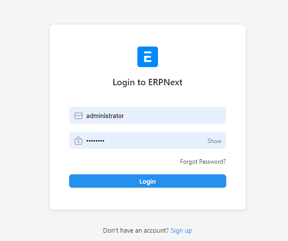

# Customer Group
This stands for which type of customer you want to add on your system apart from patients, a good example of the customer group is Health Insurance Companies. Therefore all insurance companies will belong in the same group within the system which is going to be created through the customer group section.

## steps to create customer group
### Step 1
Provide your credential to logn.

### Step 2.
After login use the search button on the top right hand side of the open page and type “New customer group” as shown in the picture and select the option from the dropdown list “New Customer Group”.

### Step 3.
After open section to create new customer group, fill the input field as shown in the picture bellow the save then save.

