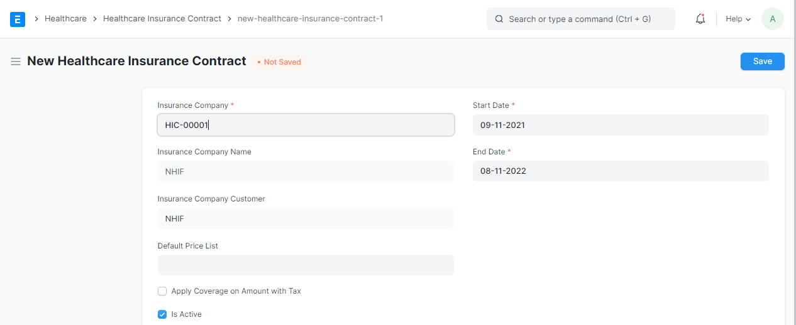

# Healthcare Insurance Contract
Health Insurance contract, is the contract between the health insurance company and the   organization that use it services. Creation of Health insurance contract is done through this steps

### Steps To Create Insurance Contract
# Step 6
GO back again to the search button and search for New Insurance Contract and select it from the list as shown in the picture below.

# Step 7
Fill the necessary input field as shown in the picture below then save it.
