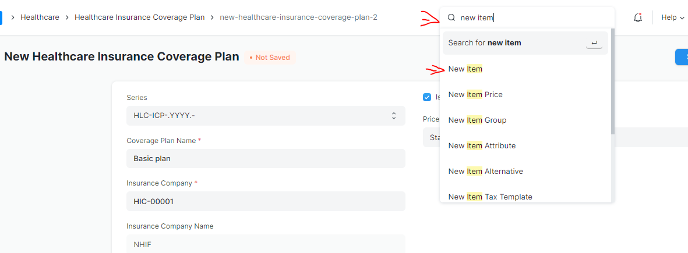
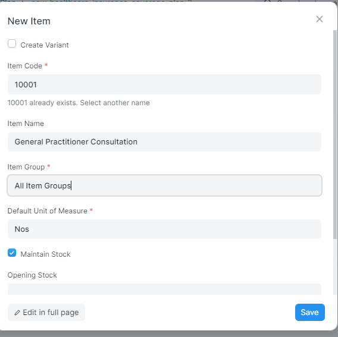
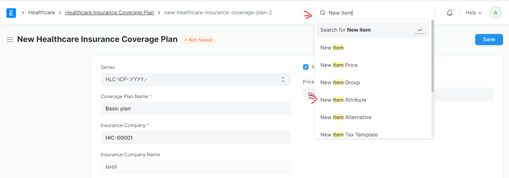
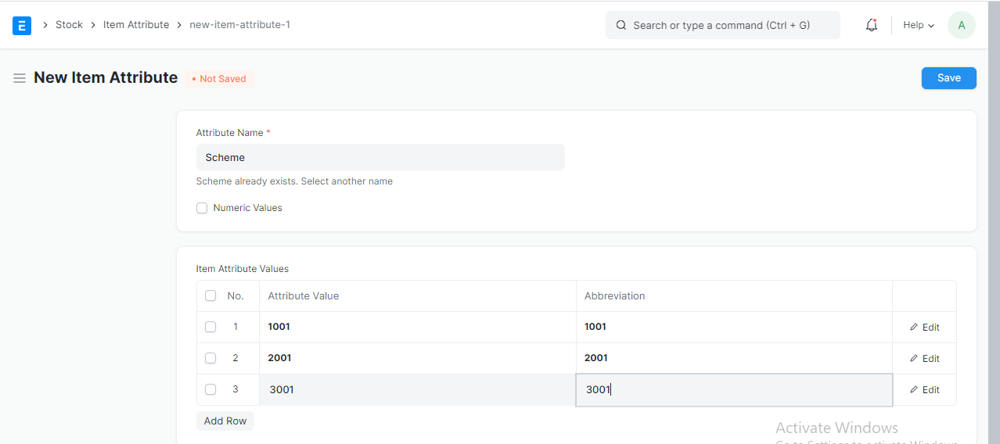
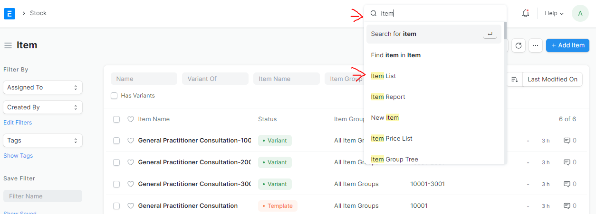
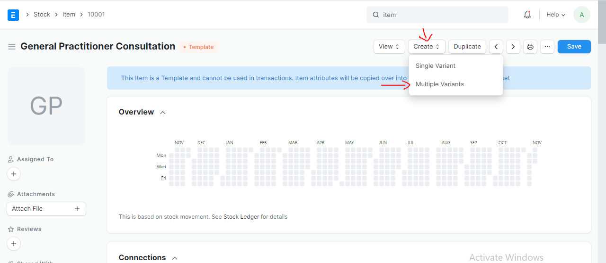
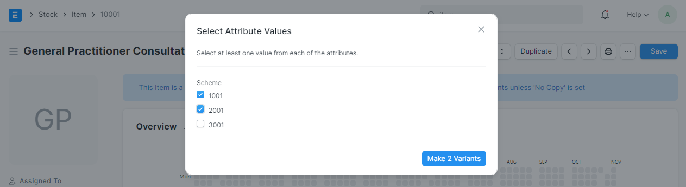

# Stock Item

### Steps to Create Stock Item

# Step 10
GO back again to the search button and search for New item  and select it from the list as shown in the picture below.

# Step 11
Fill the necessary input field as shown in the picture below then save it.

### CREATE ITEM ATTRIBUTE

# Step 12

# Step 13.
Fill the necessary input field as shown in the picture below then save it.

### CREATE ITEM VARIANTS
# Step 14

# Step 15
On the item list choose the one you want to create variant item.

# Step 16
Check for your variant attributes then save.

