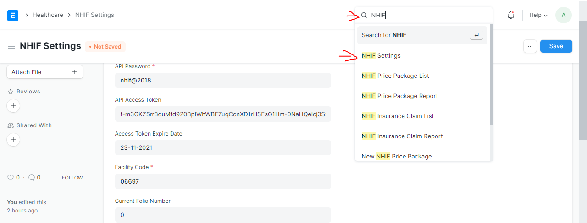
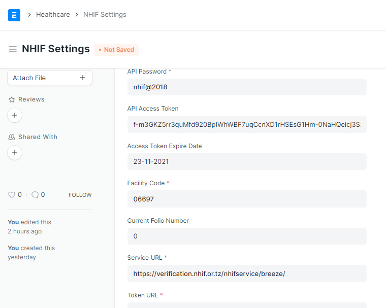

# Healthcare NHIF Setting
Allow you to do store data for configuration.

### Steps To Create NHIF Setting
# Step 8
GO back again to the search button and search for NHIF SETTING and select it from the list as shown in the picture below.

# Step 9
Fill the necessary input field as shown in the picture below then save it.

